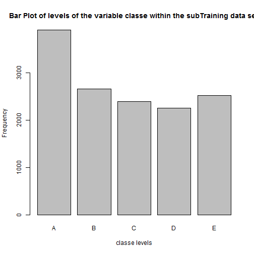
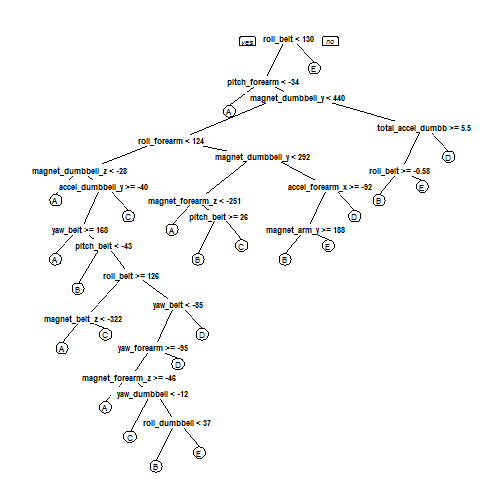

### Background

Using devices such as Jawbone Up, Nike FuelBand, and Fitbit it is now possible to collect a large amount of data about personal activity relatively inexpensively. These type of devices are part of the quantified self movement - a group of enthusiasts who take measurements about themselves regularly to improve their health, to find patterns in their behavior, or because they are tech geeks. One thing that people regularly do is quantify how much of a particular activity they do, but they rarely quantify how well they do it. In this project, your goal will be to use data from accelerometers on the belt, forearm, arm, and dumbell of 6 participants. They were asked to perform barbell lifts correctly and incorrectly in 5 different ways. More information is available from the website here: http://groupware.les.inf.puc-rio.br/har (see the section on the Weight Lifting Exercise Dataset). 

### Objective

The goal of your project is to predict the manner in which they did the exercise. This is the "classe" variable in the training set. You may use any of the other variables to predict with. You should create a report describing how you built your model, how you used cross validation, what you think the expected out of sample error is, and why you made the choices you did.

### Loading data


```r
# Load libraries
library(caret)
library(rpart)
library(rpart.plot)

# Load the training set
training <- read.csv("pml-training.csv", na.strings = c("NA", ""))

# Load the testing set
testing <- read.csv("pml-testing.csv", na.strings = c("NA", ""))
```

### Cleaning data


```r
#Removing unnecessary variables
training <- training[,-c(1:7)]
testing <- testing[,-c(1:7)]

#Also the variables with variance near zero are removed.
trainingNzv <- nearZeroVar(training)
training <- training[, -trainingNzv]
testing <- testing[, -trainingNzv]

# The variables that have NA's are removed to improve the accuracy of the model
NAs <- apply(training, 2, function(x) {
    sum(is.na(x))
})
training <- training[, which(NAs == 0)]
testing <- testing[, which(NAs == 0)]
```
### partitioning dataset training and model creation


```r
trainIndex <- createDataPartition(y = training$classe, p=0.7,list=FALSE)

trainSet <- training[trainIndex,]
testSet <- training[-trainIndex,]

# Explore training set
plot(trainSet$classe, col="gray", main="Bar Plot of levels of the variable classe within the subTraining data set", xlab="classe levels", ylab="Frequency")
```

 

```r
#look the decision tree
modRpart <- rpart(trainSet$classe ~ ., data=trainSet, method="class")
rpart.plot(modRpart)
```

 

```r
#It has been fit three models with the methods rpart, rpart2 and rf and then verified the predictive power.

rpart <- train(trainSet$classe ~ ., data = trainSet, method = "rpart")

rpart2 <- train(trainSet$classe ~ ., data = trainSet, method = "rpart2")

ctrl <- trainControl(method = "cv", number = 4)
rf <- train(trainSet$classe ~.,data = trainSet, method="rf", trControl = ctrl)

#comparing results
data.frame(rpart$result[2], rpart2$result[2], rf$result[2])
```

```
##    Accuracy Accuracy.1 Accuracy.2
## 1 0.5127671  0.3689964  0.9899541
## 2 0.4158759  0.4866719  0.9903910
## 3 0.3424631  0.5477954  0.9838393
```

### Cross-validation and Expected error


```r
# Model selected was RF because we got the highest accuracy around 99%

pred_rf <- predict(rf, testSet)

# Summarize randomForest results. 
confusionMatrix(pred_rf,testSet$classe)
```

```
## Confusion Matrix and Statistics
## 
##           Reference
## Prediction    A    B    C    D    E
##          A 1670   11    0    0    0
##          B    4 1124    4    0    0
##          C    0    3 1019   11    5
##          D    0    1    3  952    0
##          E    0    0    0    1 1077
## 
## Overall Statistics
##                                           
##                Accuracy : 0.9927          
##                  95% CI : (0.9902, 0.9947)
##     No Information Rate : 0.2845          
##     P-Value [Acc > NIR] : < 2.2e-16       
##                                           
##                   Kappa : 0.9908          
##  Mcnemar's Test P-Value : NA              
## 
## Statistics by Class:
## 
##                      Class: A Class: B Class: C Class: D Class: E
## Sensitivity            0.9976   0.9868   0.9932   0.9876   0.9954
## Specificity            0.9974   0.9983   0.9961   0.9992   0.9998
## Pos Pred Value         0.9935   0.9929   0.9817   0.9958   0.9991
## Neg Pred Value         0.9990   0.9968   0.9986   0.9976   0.9990
## Prevalence             0.2845   0.1935   0.1743   0.1638   0.1839
## Detection Rate         0.2838   0.1910   0.1732   0.1618   0.1830
## Detection Prevalence   0.2856   0.1924   0.1764   0.1624   0.1832
## Balanced Accuracy      0.9975   0.9926   0.9946   0.9934   0.9976
```

```r
#Sample Error
sum(pred_rf == testSet$classe)/nrow(testSet)*100
```

```
## [1] 99.26933
```
